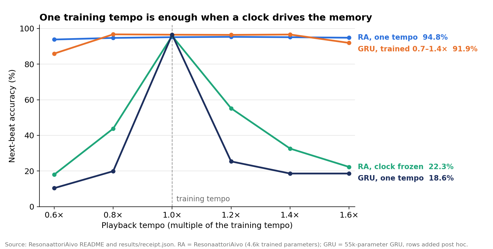

# The Ping and the Listener

*State-dependent emission, learned susceptibility, and sequence memory as a prediction engine — a working paper*

Antti Luode · 26 September 2026

## Abstract

A history channel between two learning systems opens when the listener is shaped first, and stays shut when a cheap cue teaches the listener to ignore its own state. That is the one new proposal of this paper. It comes from setting two of our experiments side by side, and it gives a computational reason why neurons might arrive pre-tuned rather than blank.

The starting picture is a neuron as a frozen wave: a structure that past input has shaped, so that some temporal patterns move it easily and others do not. Three pieces fit that picture. First, the spike itself depends on history: Martin-Burgos et al. (2026) show that action-potential waveform tracks up to 500 ms of recent input. Second, if the receiver's response also depends on its history, the effective connection on each event is a product of two states, not a fixed weight. Third, the reason to build such a system is prediction: a memory stored as "which state makes which next state easiest" can continue sequences it never stored whole.

Three small repositories test pieces of this. ResonaattoriAivo learns melodies at one tempo and continues them at 0.6–1.6× tempo with 94–95 % next-beat accuracy; its slow-band context claim failed under noise. FridayRepo shows a sender-waveform × receiver-susceptibility interaction solving a task that timing, waveform alone and additive models leave at 50 %. KapeaKanava shows the cost: generic learners rarely start communicating, a multiplicative interface lets them start, and an additive shortcut blocked history in 36 of 36 runs. Nothing here shows that brains use waveform-borne history. Section 10 states the experiment that would test the proposal directly.

## 1. Introduction: the hypothesis in plain words

The hypothesis is that a brain is an inverse model of the world built from frozen waves, and that it exists to guess what comes next. It started as an old image, the brain catching the world as it arrives in waves. On a drive after these three repositories, it came back with parts that now have measurements attached. Stated as six claims:

1. **A neuron is a frozen wave.** Its geometry, channels and synapses are what stays after past input stopped ringing. It changes slowly, following the world.
2. **Each neuron's ping is its own.** The spike's shape depends on what the neuron has just been through, so the event that leaves it carries the sender's recent history.
3. **Sequences freeze too.** The order in which things arrived becomes structure: being in state A makes B the easiest next state.
4. **Recall is re-entering the rhythm.** The old feeling of putting oneself into a sequence until the memory follows is literal. Recall drives the system into the state from which the stored continuation is easiest.
5. **The system is the inverse of its input.** It produces what it expects, so the expected goes quiet and only the unexpected remains.
6. **Intelligence comes from overlap.** A memory made from many past sequences does not hold one path. From each state it holds several possible continuations, and choosing among them is guessing what comes next. An animal that guesses well survives.

None of these is proven by what follows, and several are old ideas under new names. The paper's job is to say, for each claim, what is established, what our three small repositories measured, and what is still only a picture. The repositories were built this week by two AI collaborators, Claude (ResonaattoriAivo, KapeaKanava) and ChatGPT (FridayRepo), from the ideas above. Section 7 holds the one result that comes from reading them together.

## 2. The biological premise: the ping carries recent history

Martin-Burgos et al. (2026) show that within one neuron, action-potential shape varies with recent input and with local network state, not randomly. That supports claim 2. It does not show that any downstream neuron reads the variation.

What they measured, from two public datasets:

| finding | number | data |
| --- | --- | --- |
| Stimulus type (constant, ramp, pink noise) decoded from waveform alone | 78.4 % ± 0.7 %, chance 33 % | pvc-6, one SST+ mouse cell, 200 kHz |
| Recent pink-noise statistics predicted from waveform | R² 0.72 (mean), 0.35 (SD), 0.62 (spectral exponent) | same cell |
| How far back the waveform "remembers" the input mean | still improving at 500 ms before the spike | same cell; weaker in a second cell |
| Cells with multimodal waveform states | 30 of 40 (75 %) | spe-1, rat somatosensory cortex in vivo |
| Waveform state vs firing-interval state | nearly independent, median η² 0.013 | spe-1 |
| Spikes more different from their own cell's average than typical between-cell difference | most spikes in 2 cells; over 25 % of spikes in 4 cells | spe-1 |
| Local field amplitude predicted better by waveform than by firing interval | 87–90 % vs 46–51 % of cells; mean CV R² 0.077, median 0.034 | spe-1, 39 cells |
| Theta, gamma and aperiodic LFP spectra predicted by waveform | not significant at population level | spe-1 |

Three details matter for this paper. First, the waveform integrates hundreds of milliseconds of input, which is the timescale of a sequence element, not of a single spike. Second, the waveform-to-state relationship is cell-specific: for decay rate against peak amplitude, 26 cells correlate positively and 17 negatively. There is no universal dictionary in which a wide spike means one thing. Third, the paper points to older work showing that broader presynaptic spikes raise and lengthen the postsynaptic current (Jackson et al. 1991; Sabatini & Regehr 1997; Geiger & Jonas 2000). So a changed ping can change what the next cell receives.

The limits are as important as the findings.

- **Soma, not terminal.** The recordings are somatic. The axon regenerates the spike at every node, so a somatic shape reaches only terminals within the analog length constant of the axon, roughly 150–700 µm (Shu et al. 2006; Alle & Geiger 2006; Kole et al. 2007). Near targets can hear the sender's state; distant ones mostly hear only timing.
- **Small causal sample.** The stimulus-driven results rest on one cell with a partial replication in a second.
- **Modest network link.** Waveform explains a few percent of LFP amplitude variance on average, and nothing about oscillation spectra. The paper gives no support to a theta/gamma waveform code.
- **No reader shown.** Nothing in the paper tests whether a receiving neuron's response depends on sender waveform in a way that changes computation.

The cell-specific result is the one that points somewhere. If the same waveform change means different things in different cells, meaning is not in the ping. It is in the match between the ping and whatever receives it. That is the framework of the next section.

## 3. Framework: ping × listener, and memory as the listener's shape

The effective connection between two neurons on a given event is the overlap between what the sender emits in its current state and what the receiver is sensitive to in its current state. Long-term memory is the slowly changing structure that decides both.

Write the sender's state as $`x_i`$ and its emitted event as a short waveform $`s_i`$ that depends on that state. Write the receiver's temporal response kernel as $`h_j`$, which depends on the receiver's state $`x_j`$ and its slow structure $`\theta_j`$. The effect of one event arriving with delay $`\Delta t`$ is:

```math
K_{ij}(x_i, x_j, \Delta t) = \int h_j(\tau \mid x_j, \theta_j)\, s_i(\tau - \Delta t \mid x_i)\, d\tau
```

The classical weight $`w_{ij}`$ is the special case where neither $`s`$ nor $`h`$ depends on state. In this form, timing lives in $`\Delta t`$ and in the geometry behind $`h`$. Sender history lives in $`s`$. Receiver history lives in $`h`$. "Resonance" is simply a large overlap.

Three consequences follow.

**The vibration is the reader, not the memory.** A passive resonator rings down:

```math
a(t) = a_0\, e^{-\gamma t}\, e^{i \omega t}
```

With any damping, the ringing is gone in a few time constants. What lasts is $`\theta`$: lengths, channel densities, couplings, synapses. A structure can sit silent and still be read later by the right probe. That is claim 1 made precise: the frozen wave is the shape of $`h`$, not a vibration that keeps going.

**A sequence is a path through susceptibilities.** After A arrives, the state $`x`$ has moved, so $`h`$ has changed, so a different next input now produces the largest response:

```math
x_{t+1} = F\big(x_t,\; h(x_t) * s_t\big)
```

No list A → B → C is stored anywhere. A leaves the system in a state where B is easiest, and B does the same for C. Recall by cue (claim 4) is getting $`x`$ into the right region, after which the continuation unrolls by itself.

**Prediction is cancellation.** If the system produces an expected input $`\hat{u}`$ and subtracts it, only the residue $`e`$ remains:

```math
e(t) = u(t) - \hat{u}(t)
```

Familiar input goes quiet; new input stays loud. The residue is also the natural learning signal for $`\theta`$. The clearest biological case is the electric fish, whose cerebellum-like electrosensory lobe learns a negative image of its own predictable discharge (Bell 1981; Bell et al. 1997). The cerebellar adaptive-filter theory describes the same motif: a bank of delays whose weighted sum is subtracted from input (Fujita 1982; Dean et al. 2010). This is what claim 5 calls the inverse; in control terms it is a forward model plus subtraction.

One limit shapes the rest of the paper. A purely linear response can only replay: the response to A and B together is the sum of the separate responses. New combinations need $`K`$ to depend on both states jointly, which makes the interaction multiplicative. Sections 5 and 6 are about when learning can find such an interaction and when it cannot.

| claim | term in the framework |
| --- | --- |
| 1. neuron as frozen wave | slow structure $`\theta`$ that shapes $`h`$ |
| 2. unique ping | state-dependent waveform $`s(x_i)`$ |
| 3. frozen sequence | a path of states, each making the next easiest |
| 4. recall by rhythm | driving $`x`$ into the region where the stored path starts |
| 5. inverse of the world | predicted input $`\hat{u}`$ subtracted from input |
| 6. intelligence from overlap | several easy continuations from one state; the choice and the residue's update of $`\theta`$ |

## 4. Evidence I: ResonaattoriAivo — recall by rhythm

ResonaattoriAivo supports claim 4 most directly: a cue that puts the system in the right phase lets it continue a learned melody alone, at tempos it never heard. It also shows that the plastic part of memory is the response geometry. The slow-band context story did not hold.

The machine is a bank of damped resonators per input channel, each with a decay τ and frequency ν measured in beats. A phase-locked clock, seeded by a four-click count-in, advances the resonators by phase rather than by time. A fixed random layer of 512 tanh units sits on top. The readout learns only from the residue, the actual next note minus the predicted one, and releases one note per beat slot. Every gate was written down and committed before the first run.



*Next-beat accuracy by playback tempo. Source: [ResonaattoriAivo](https://github.com/anttiluode/ResonaattoriAivo) README and `results/receipt.json`; the GRU rows were added post hoc.*

The clock turns time into phase, so "two beats ago" is the same state at any tempo. The melody is stored as a shape over phase, not over milliseconds. Freezing the clock at the training tempo removes the transfer, so the clock, not the resonators alone, provides it.

| test | result |
| --- | --- |
| Free run after a 12-beat cue | 97.3 % mean over tempos; 100 % at 1.0× |
| Residue as surprise | AUROC 1.00, novel vs familiar melody; a swapped note located in 90 % of cases |
| Speeding up / slowing down during a melody | 91.0 % / 93.5 % |
| Slow bands carry context past a 6-beat shared segment | **fail**: 97 % without slow bands (needed ≤ 60 %) |
| Slow bands under small state noise | no advantage; noise piles up in the slow modes |

**Stage 2: the residue retunes the listener.** At state noise 0.01, a fixed geometry falls to 58.7 %. Letting the residue retune 16 resonator numbers (τ, ν) restores 88.3 %; retuning the 74k mode-to-unit couplings restores 96.1 %, and adding the resonators on top adds nothing. Claim 1 holds in the form "the response geometry must be plastic". It does not hold in the form "it must be the resonance frequencies", though per number the resonators are by far the most efficient.

**Stage 3: the unique ping helped, but not as memory.** A long-memory sender added a three-number state-dependent shape to each event for a short-memory receiver. Whole-song accuracy rose from 73.3 % to 83.4 %, and clamping or shuffling the shapes dropped the receiver to 28.9 % and 26.7 %, below having no shapes at all. But a sender with only short memory gave the same gain (82.9 %), and transplanting the sender's history redirected only 2 of 6 cases. The shape carried the sender's processing, not its old history. Learning took the cheaper route, which is the first sign of the problem Sections 6 and 7 make precise.

## 5. Evidence II: FridayRepo — when the ping has to carry history

FridayRepo shows that the sender's ping becomes necessary only when the question arrives after the message has been sent. When the question is known in advance, a generic network simply computes the answer early and the ping carries nothing new. When it is not, one noisy number is enough to carry the part of the past the receiver lacks.

The repository climbs four steps, each removing one thing the previous step handed to the model.

| step | what the model was given | main result | what it taught |
| --- | --- | --- | --- |
| 1. Constructed coupling | Sender and receiver states; a planted waveform difference with equal timing, area, energy and peak | 97.8 % vs 50 % for timing only, waveform only, frozen receiver and an additive model given both states. A receiver kernel learned from noisy examples: 96.1 ± 0.6 %, 16 seeds | The interaction term is the whole computation. The 50 % baselines are forced by the task, which is an XOR. |
| 2. Learned histories | Raw noisy 24-step histories; the factorized form waveform × susceptibility; no state labels | 95.0 ± 1.0 %, 16 seeds; learned states decode their history at 97.6 % and 97.4 %; shuffling either history gives 50 % | Given the factorization, learning finds the states and the temporal interface from final error alone. |
| 3. Generic network | One 12-unit recurrent network, both histories, then an identical late ping | 4 of 8 seeds solve it (97.3 ± 1.6 %). The answer is readable **before** the ping at 97.3 % | With a predictable question, the network compiles the answer early. The ping is not needed. |
| 4. Late, unknown query | Separate sender and receiver; a noisy message; one of three questions revealed only to the receiver, afterwards | One scalar message: 0.136 ± 0.005 error with a cheap cue present, 4 of 4 seeds; wider channels add nothing | The message carries the one missing coordinate of the sender's past, and nothing else. |

Step 3 is the turn. A recurrent network that sees both histories and a fixed question never needs to listen to a later ping, so it does not. A probe finds two weak history directions (77 % and 78 % decodable) whose product predicts the answer at 95.4 %, while their sum sits at 55 %. So an interaction-shaped geometry exists inside the generic state, but it is used to precompute, not to receive.

Step 4 removes that escape. The sender must commit to a message before it knows which of three questions will be asked. The three questions have target tables of rank 1, 2 and 3, and a cheap cue given directly to the receiver supplies the first rank-1 component. A linear reader would then need a two-dimensional message. The nonlinear receiver needs one: the learned message stays effectively one-dimensional even when four dimensions are free, and its direction matches one of the task's hidden sender directions at |r| = 0.99985. Shuffling the sender's history after training raises the error from 0.136 to 0.714; erasing the sender's memory returns it to the cue-only level of 0.611.

For the hypothesis, step 4 is the closest measured form of claim 2. What crosses between the two systems is not a copy of the past. It is the complement of what the receiver will already know when the question comes. Without the cheap cue, the same learners were unreliable: at most 1 of 4 seeds succeeded at any width, and even direct access to both histories was unstable. That last detail is where Section 7 begins.

## 6. Evidence III: KapeaKanava — the cost of starting to talk

KapeaKanava shows that the hard part is not computing the interaction but starting to communicate at all. Generic learners almost never start; a multiplicative listener lets them start; and a cheap additive signal sent through the same channel froze history out in all 36 runs where it existed.

The set-up: each side sees a noisy two-channel history whose class (one of four) is set only by the order of four events. The target is a 4 × 4 table $`T[c_s, c_r]`$ over sender class and receiver class, with zero row and column means and a chosen rank $`r`$. The sender emits a $`k`$-dimensional message, noise is added, and the receiver answers. A linear reader can reach at most $`R^2 = k/r`$. A single network that sees both histories solves every rank (R² 0.995–0.998), so the task is learnable. Predictions were committed before any run.

**Startup, not computation, is the barrier.**

| receiver | learned sender, rank 1 | learned sender, rank 3 | perfect (oracle) message, rank 3 |
| --- | --- | --- | --- |
| generic tanh network | 0 of 3 seeds start | 0 of 3 | 2 of 3 (R² 0.999) |
| wide ReLU network | 2 of 3 | 0 of 3 | 3 of 3 (0.999) |
| gated recurrent, message as input event | 1 of 3 | 0 of 3 | 3 of 3 (0.994) |
| multiplicative (message × function of own state) | 3 of 3 | 2 of 3 | — |

Every generic receiver can compute the answer when handed a perfect message. None can reliably get there with a learning sender. The reason is structural. Because T has zero row and column means, the message alone says nothing about the answer and the receiver's own state alone says nothing either; only their product does. A receiver that starts out roughly additive therefore sees no gradient to follow, and a sender facing a deaf receiver has none either. Each side waits for the other. A multiplicative receiver has the product built in, so the first gradient step already points somewhere.

**When learning starts, it reaches the bound.** Wherever any seed started, the best seed landed within 0.012 of $`k/r`$ (0.499 of 0.5; 0.328 of 0.333; 0.655 of 0.667). Starting got harder with higher rank, more noise, and a channel exactly as wide as the rank. Spare width helped: at noise 0.3, rank 2 started in 0 of 3 seeds with 2 or 3 dimensions and in 3 of 3 with 4.

**Economy comes from noise, not from a price.** At high noise, the multiplicative pair used exactly as many message dimensions as the rank, with no cost term. Adding a small energy cost on the message (λ = 0.01) stopped rank 2 and 3 from starting at all (R² 0.13 and 0.30). A cost pushes the message to zero before it can become useful, which deepens the deadlock.

**The shortcut froze history out.** A random value $`z`$ was placed in the sender's last few steps and added to the target, $`y = T + \beta z`$. It is cheap, additive, and explains as much variance as the history interaction. It was taken within about 200 steps in every run. After that, the fraction of the history interaction carried stayed within ±0.01 of zero, exactly where a sender with no memory sits. This held even at four dimensions, where the same pair without the shortcut starts every time.

The pre-registered scorecard: four predictions held or mostly held, four failed, and two were void because generic pairs never started.

## 7. Listener first: why a cheap cue opened the channel once and closed it once

The two repositories disagree about cheap cues, and the disagreement is the most informative result in this paper. In FridayRepo a cue helped old history cross the channel; in KapeaKanava a cue blocked it completely. The difference is what each cue taught the listener about its own state.

|  | FridayRepo, step 4 | KapeaKanava |
| --- | --- | --- |
| where the cue arrives | at the receiver, beside the channel | in the sender's history, through the same channel |
| how it relates to the answer | a partial interaction: the first rank-1 part of the table, useful only when combined with the receiver's own state | additive: $`\beta z`$, whatever anyone's state is |
| what it trains the receiver to do | read outside input jointly with its own state | read the channel without regard to its own state |
| history carried | yes: 4 of 4 seeds, one scalar enough; without the cue at most 1 of 4 | no: 0 of 36 runs |

Section 6 explained why a pure interaction cannot start on its own: the message alone and the receiver's state alone each carry zero signal about the answer, so neither side has a gradient until the other has moved. Now look at what each cue does to that deadlock.

KapeaKanava's cue is additive. The receiver learns it with an ordinary first-order gradient and settles into reading the channel the same way whatever its own state. The sender's message becomes a copy of $`z`$. Nothing in the receiver has become state-dependent, so a history-dependent change in the message still meets a flat listener. The deadlock is intact, and now the channel is also occupied.

FridayRepo's cue is a piece of the interaction itself. To use it at all, the receiver must learn to combine outside input with its own state. Once it has done that, its sensitivity to the channel already depends on its state, and a sender perturbation that tracks the remaining error has a first-order gradient to follow. The listener moves first; then the ping acquires meaning.

The proposal, stated as a hypothesis:

> **A history channel between two learning systems opens when something first makes the receiver's sensitivity depend on its own state. It stays closed when the first thing learned makes the receiver's reading independent of its state.**

This rests on a comparison, not a controlled experiment. The two set-ups also differ in architecture, noise, the number of questions and which side the cue enters, so any of those could matter instead. Section 10 gives the 2 × 2 experiment that separates them.

The idea is not new in its general form, which makes it more credible rather than less. In animal signalling it is sensory exploitation: female túngara frogs' hearing was already tuned below the average call frequency before males evolved the low "chuck" that exploits it, and a related species shows the bias without the call (Ryan et al. 1990). The signal evolved to fit a listener that already existed. In multi-agent learning, Eccles et al. (2019) trace the failure to learn communication from scratch to a joint exploration problem and add explicit signalling and listening biases. KapeaKanava's multiplicative receiver is a built-in listening bias of exactly that kind.

What is specific here is the neural reading. A neuron's intrinsic, state-dependent susceptibility (resonance from its channels, filtering from its dendrites; Hutcheon & Yarom 2000) is a pre-existing listener bias. On this view it is not decoration: it is what lets a state-dependent ping acquire meaning during learning at all. That offers one computational reason for Buzsáki's picture of a brain that arrives with preconfigured dynamics, which experience then fills with meaning (Buzsáki 2019; Dragoi & Tonegawa 2011, whose "preplay" evidence is disputed). It also answers the question FridayRepo ended on, whether learning wants to invent the emission × susceptibility factorization. In these experiments it does not. It needs the factorization to begin.

## 8. Why guessing needs sequences, and where intelligence sits

An animal has to act before the world finishes happening, so it needs to guess what comes next, and the world is regular mostly in time. Sequence memory is the cheapest predictor there is. The drive thought adds the important part: stored the right way, many past sequences stop being separate recordings and become one flexible map of possible continuations.

**Tapes predict repeats; susceptibilities generalize.** A memory that stores each sequence as its own tape can only continue what it has seen exactly. A memory that stores "from this state, which next state is easiest" (Section 3) is forced to share structure. Two melodies that pass through the same state leave that state with two easy continuations. The memory becomes a branching map, and crossing at a shared state produces a sequence that was never stored whole. Flexibility is not an extra feature; it is what happens when sequences are stored as the shape of a shared listener. Interference is the price of the same mechanism.

This is well-trodden ground, which is a good sign. The temporal context model treats recall as a slowly drifting context that cues the next item (Howard & Kahana 2002). The successor representation stores, for each state, the expected future states, and has been proposed as what the hippocampus holds (Stachenfeld, Botvinick & Gershman 2017). Hawkins & Ahmad (2016) argue that dendrites let one neuron hold several predicted continuations at once. Large language models are the strongest engineering evidence: trained only to guess the next token, they acquire broad abilities. The system writing this paper was made that way.

**Recall by rhythm is re-entering the map.** "Put myself into the sequence and the memory follows" means driving one's own state to the start of a path, after which each state makes the next one easiest. ResonaattoriAivo's free run is the small version: 12 beats of cue, then 97.3 % correct continuation on its own clock, at any tempo.

**The inverse model is how the guess is used.** A system that plays its guess against the incoming world hears only the difference. ResonaattoriAivo's residue separated new melodies from familiar ones perfectly and found a single swapped note 90 % of the time. Attention, learning and energy can then be spent on surprise alone.

**Where intelligence sits.** Resonance and susceptibility give storage and recall; on their own they make a very good jukebox. The intelligent part lives in three places:

1. **The choice at a junction.** When one state allows several continuations, something must pick one from context the current state does not hold. ResonaattoriAivo's junction test was meant to probe this and was too easy (Section 4).
2. **What the residue changes.** Surprise has to reshape the listener, so that the next guess is better. ResonaattoriAivo Stage 2 is the first measured case: retuning the listener recovered 30 points under noise.
3. **Which probe to send next.** A system that chooses what to listen for, or which rhythm to try while remembering, is choosing its own evidence.

**This is where the unique ping earns its place.** At a junction the receiver's own state is, by definition, not enough to choose. The deciding context is older history held somewhere else. FridayRepo's late query is exactly this situation: the question arrives after the sender has fired, and the sender's one number supplies what the receiver lacks. So the claims of Section 1 connect: flexible sequence memory creates junctions, junctions create the need for history from elsewhere, and a state-dependent ping is a way to deliver it. Section 7 adds the condition: the listener must already be shaped to hear it, or learning takes the shortcut and the ping stays empty, as it did in ResonaattoriAivo Stage 3.

## 9. Ledger: established, measured here, not shown

Most of the parts are old; what is ours is a small set of measurements and one proposal that reads an old idea in neural terms. Nothing here shows that a brain does any of it.

| claim | status | basis |
| --- | --- | --- |
| Spike waveform depends on recent input and network state | established, small samples | Martin-Burgos et al. 2026; de Polavieja et al. 2005 |
| A broader presynaptic spike changes the postsynaptic current | established | Sabatini & Regehr 1997; Geiger & Jonas 2000 |
| Somatic state reaches only terminals within ~150–700 µm | established | Shu et al. 2006; Alle & Geiger 2006; Kole et al. 2007 |
| Receiving neurons read waveform-borne history | **not shown** | no experiment yet |
| A phase clock gives recall at any tempo from one training tempo | measured here | ResonaattoriAivo G2, 6 tempos; parts from Large & Kolen 1994 and Tallec & Ollivier 2018 |
| Memory lives in a plastic listener geometry, not in ongoing vibration | old idea, measured here | reservoir computing, adaptive-filter theory; ResonaattoriAivo Stage 2, +30 points under noise |
| Prediction as cancellation, residue as surprise | established; toy measurement | Bell 1981; ResonaattoriAivo G5, AUROC 1.00 |
| Slow resonant bands carry sequence context | **not supported** | ResonaattoriAivo G4 failed; no benefit under noise |
| Sender waveform × receiver susceptibility is learnable from raw histories | measured here | FridayRepo step 2, 95.0 %, 16 seeds (the 50 % baselines are forced by the XOR task) |
| With a predictable question, generic networks precompute and ignore the ping | measured here | FridayRepo step 3, 4 of 8 seeds solved |
| Under a late, unknown question, one noisy number carries the missing past | measured here | FridayRepo step 4, 4 seeds, one task |
| Learning to communicate from scratch deadlocks | established; clean measurement here | Eccles et al. 2019; KapeaKanava, 3 seeds per cell |
| A cheap additive shortcut freezes history out of the channel | measured here | KapeaKanava, 0 of 36 runs carried history |
| Listener first: a state-dependent listener must exist before a history channel can open | **hypothesis** | Section 7 comparison; precedent in Ryan et al. 1990 |
| Stored as susceptibilities, many sequences become a flexible predictive map | old idea, barely tested here | Howard & Kahana 2002; Stachenfeld et al. 2017; Hawkins & Ahmad 2016; junction test too easy |

Three weaknesses run through all three repositories. The worlds are tiny and clean: 12 songs and 8 pitches, or four history classes. Seeds are few: 3 to 16 per condition. And every "waveform" is an abstract vector or a short hand-made shape, never a simulated or recorded spike.

## 10. Predictions and the decisive next experiment

One small experiment can confirm or kill the listener-first proposal: cross the two kinds of cue with the two routes, inside one set-up. Everything else in this section follows only if it survives.

**10.1 The 2 × 2.** Use KapeaKanava's task, receivers, noise levels and training budget, with at least 8 seeds per cell. Vary only the cue.

|  | cue given directly to the receiver | cue sent through the sender's channel |
| --- | --- | --- |
| **relational cue** (a partial interaction, useful only with the receiver's own state) | FridayRepo-like | new |
| **additive cue** ($`\beta z`$, state-independent) | new | KapeaKanava as run |

Add two arms that change only the listener: a receiver pre-trained on an unrelated task that forces it to read outside input jointly with its own state, and a fresh receiver with no cue. Measure how often communication starts, how fast, and the fraction of the history interaction carried.

Pre-registered predictions:

1. **Cue type decides, not route.** Both relational cells carry history in most seeds, including generic receivers that never start without a cue. Both additive cells carry history in close to 0 runs.
2. **A pre-shaped listener starts more often.** Generic receivers with state-dependent pre-training start communication in clearly more seeds than fresh ones, with no cue at all.
3. **The additive cue is harmless if the listener is already shaped.** Introduced after history communication has started, it is absorbed without erasing the history channel.

What would kill it: if route decides instead (any cue at the receiver helps, any cue in the channel blocks), the simpler story is channel occupancy and the proposal is wrong. If pre-training the listener changes nothing, the proposal is at best incomplete.

**10.2 The build: a machine that chooses at junctions.** If 10.1 holds, the next ResonaattoriAivo stage puts every claim in one machine. Two modules: a long-memory sender that emits state-dependent event shapes, and a short-memory receiver whose susceptibility has been shaped first. Songs share long segments under state noise, so the receiver alone cannot choose the continuation. The pass condition is the test Stage 3 failed: transplanting the sender's old history must redirect the receiver's continuation, in most eligible cases, at every tempo. A browser demo would let one hear it pick the right branch after the shared stretch.

**10.3 The biology.** The paper's framework predicts that the effect of a presynaptic waveform on a postsynaptic cell is an interaction between the waveform's shape and the receiver's state, not a sum. A paired recording within the analog length constant could test it: vary presynaptic spike shape (for example by subthreshold somatic depolarization, as in analog-digital facilitation studies) and vary the receiver's resonance (for example by blocking its h-current). The prediction concerns shape × filtering, which must be separated from the plain driving-force effect of postsynaptic voltage on current size. This is the one experiment that could move "receiving neurons read waveform-borne history" out of the not-shown column.

## References

Linked items were opened for this draft. Unlinked references are cited from memory and should be checked before this paper leaves the lab.

**Repositories**

- [ResonaattoriAivo](https://github.com/anttiluode/ResonaattoriAivo) — resonator sequence memory; Stages 1–3; built by Claude.
- [FridayRepo](https://github.com/anttiluode/FridayRepo) — waveform × susceptibility ladder and late-query channel; built by ChatGPT.
- [KapeaKanava](https://github.com/anttiluode/KapeaKanava) — narrow noisy channel, rank bound, startup and shortcut; built by Claude.

**Literature**

- Alle H, Geiger JRP (2006). Combined analog and action potential coding in hippocampal mossy fibers. *Science* 311:1290–1293.
- Bell CC (1981). An efference copy which is modified by reafferent input. *Science* 214:450–453.
- Bell CC, Han VZ, Sugawara Y, Grant K (1997). Synaptic plasticity in a cerebellum-like structure depends on temporal order. *Nature* 387:278–281.
- Buzsáki G (2019). *The Brain from Inside Out.* Oxford University Press.
- Dean P, Porrill J, Ekerot C-F, Jörntell H (2010). The cerebellar microcircuit as an adaptive filter. *Nat Rev Neurosci* 11:30–43.
- de Polavieja GG, Harsch A, Kleppe I, Robinson HPC, Juusola M (2005). Stimulus history reliably shapes action potential waveforms of cortical neurons. *J Neurosci* 25:5657–5665.
- Dragoi G, Tonegawa S (2011). Preplay of future place cell sequences by hippocampal cellular assemblies. *Nature* 469:397–401.
- Eccles T, Bachrach Y, Lever G, Lazaridou A, Graepel T (2019). [Biases for emergent communication in multi-agent reinforcement learning](https://arxiv.org/abs/1912.05676). *NeurIPS 2019.*
- Fujita M (1982). Adaptive filter model of the cerebellum. *Biol Cybern* 45:195–206.
- Geiger JRP, Jonas P (2000). Dynamic control of presynaptic Ca²⁺ inflow by fast-inactivating K⁺ channels in hippocampal mossy fiber boutons. *Neuron* 28:927–939.
- Hawkins J, Ahmad S (2016). Why neurons have thousands of synapses, a theory of sequence memory in neocortex. *Front Neural Circuits* 10:23.
- Howard MW, Kahana MJ (2002). A distributed representation of temporal context. *J Math Psychol* 46:269–299.
- Hutcheon B, Yarom Y (2000). Resonance, oscillation and the intrinsic frequency preferences of neurons. *Trends Neurosci* 23:216–222.
- Jackson MB, Konnerth A, Augustine GJ (1991). Action potential broadening and frequency-dependent facilitation of calcium signals in pituitary nerve terminals. *PNAS* 88:380–384.
- Kole MHP, Letzkus JJ, Stuart GJ (2007). Axon initial segment Kv1 channels control axonal action potential waveform and synaptic efficacy. *Neuron* 55:633–647.
- Large EW, Kolen JF (1994). Resonance and the perception of musical meter. *Connection Science* 6:177–208.
- Martin-Burgos B, Juavinett A, Rivière PD, Hammonds R, Voytek B (2026). [Action potential waveforms are state-dependent](https://doi.org/10.64898/2026.09.15.751814). *bioRxiv* 2026.09.15.751814.
- Ryan MJ, Fox JH, Wilczynski W, Rand AS (1990). [Sexual selection for sensory exploitation in the frog *Physalaemus pustulosus*](https://www.nature.com/articles/343066a0). *Nature* 343:66–67.
- Sabatini BL, Regehr WG (1997). Timing of neurotransmission at fast synapses in the mammalian brain. *J Neurosci* 17:3425–3435.
- Shu Y, Hasenstaub A, Duque A, Yu Y, McCormick DA (2006). Modulation of intracortical synaptic potentials by presynaptic somatic membrane potential. *Nature* 441:761–765.
- Stachenfeld KL, Botvinick MM, Gershman SJ (2017). The hippocampus as a predictive map. *Nat Neurosci* 20:1643–1653.
- Tallec C, Ollivier Y (2018). Can recurrent neural networks warp time? *ICLR 2018.*
